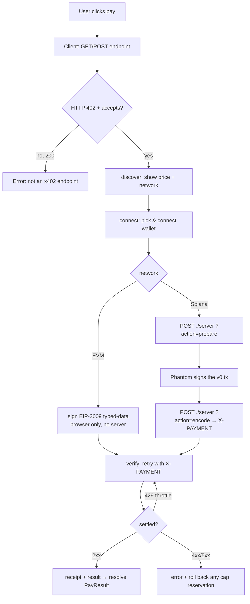

# @nirholas/x402-payment-modal

> The complete drop-in checkout for any [x402](https://x402.org) paid endpoint — wallet connect, sign, settle, receipt.

[](https://www.npmjs.com/package/@nirholas/x402-payment-modal)
[](https://www.npmjs.com/package/@nirholas/x402-payment-modal)
[](https://bundlephobia.com/package/@nirholas/x402-payment-modal)
[](./LICENSE)

**A drop-in payment modal for any [x402](https://x402.org) paid endpoint.** The
browser client is one ES module with zero runtime dependencies; it turns an HTTP
`402 Payment Required` challenge into a polished checkout: wallet connect (Phantom
/ Solflare / Backpack on Solana, MetaMask / any EVM wallet on Base via EIP-3009),
the `402 → sign → settle` flow, optional SIWX re-entry, client-side spending caps,
and a receipt. It ships a **server** checkout adapter for the Solana rail
(`./server`, `./server/express`, `./server/vercel`) and a **React** wrapper
(`./react`) — pick only the pieces you need. Vanilla JS, no bundler required.

```html
<script type="module" src="https://unpkg.com/@nirholas/x402-payment-modal"></script>

<button
  data-x402-endpoint="https://api.example.com/paid/summarize"
  data-x402-method="POST"
  data-x402-body='{"text":"hello"}'
  data-x402-merchant="Acme"
  data-x402-action="Summarize">
  Pay &amp; Run
</button>
```

That's the whole integration. Clicking the button opens the modal, runs the
payment, calls your endpoint with the signed `X-PAYMENT` header, and fires an
`x402:result` event with the response.

---

## Why

x402 lets any HTTP endpoint charge a micropayment per call: the server answers an
unpaid request with `402` and a list of accepted payments; the client pays and
retries with an `X-PAYMENT` header. The protocol is simple — the *wallet UX* is
not. This package is the missing front end: a single, framework-agnostic modal
that handles wallet detection, chain switching, signing, settlement, errors,
throttle retries, and the receipt, so you ship a paid endpoint in minutes.

- **Zero dependencies, zero build.** Plain ES module. Drop in a `<script>` tag or
  `import` it. The Solana/EVM crypto helpers are loaded lazily from a CDN *only*
  when a payment is actually attempted.
- **Solana + EVM.** Phantom (Solana) and any injected EVM wallet (Base USDC
  via EIP-3009 `transferWithAuthorization`). The modal picks the right path from
  the 402 challenge.
- **USDC by default, multi-token if you want it.** USDC is the always-on default
  on Solana. Optionally offer a second SPL token (the modal ships a built-in
  `THREE` opt-in) and the buyer gets a token picker — each token is recognized on
  sight (symbol, decimals). See
  [Accepting multiple Solana tokens](#accepting-multiple-solana-tokens).
- **SIWX re-entry.** If a wallet already paid for a resource, it can sign back in
  instead of paying again. See [docs/siwx.md](docs/siwx.md).
- **Spending caps.** Optional per-call / hourly / daily caps enforced in the
  browser. See [docs/spending-caps.md](docs/spending-caps.md).
- **Themeable.** Light + automatic dark mode, a full `--x402-*` design-token
  surface, runtime brand-matching, and a header logo. See
  [docs/theming.md](docs/theming.md).
- **Accessible.** Focus trap + restore, `aria-modal`, `aria-live` step
  announcements, `:focus-visible` rings, `prefers-reduced-motion`, keyboard `Esc`
  to close.
- **Server + React adapters in the box.** Framework-agnostic Solana checkout
  (`./server`) with Express and Vercel adapters, and a first-class React wrapper
  (`./react`) — all behind separate export subpaths, all optional.

---

## Which x402 modal do I want?

This package has a lighter sibling, **[`@nirholas/x402-modal`](https://www.npmjs.com/package/@nirholas/x402-modal)**.
Both render a drop-in modal; choose by how much you need.

| | **`@nirholas/x402-payment-modal`** (this) | `@nirholas/x402-modal` |
| --- | --- | --- |
| Goal | Full checkout SDK: client **+ server + React** | Minimal client-only modal |
| Chains | Solana **and** EVM (Base/Arbitrum/Optimism) | Client modal, EVM-leaning |
| Solana server adapter | ✅ `./server` + Express + Vercel | ❌ bring your own |
| React wrapper | ✅ `./react` (`X402Button`, `useX402`) | ❌ |
| SIWX re-entry | ✅ | — |
| Client spending caps | ✅ per-call / hour / day | — |
| Multi-token picker (USDC + opt-in SPL) | ✅ | — |
| Builder-code (ERC-8021) echo | ✅ | — |
| Footprint | Larger (more surface) | Smaller, fewer knobs |

**Rule of thumb:** taking real Solana payments, want a React component, or need
caps/SIWX → use **this** package. Just need a tiny EVM paywall button and nothing
else → the lighter `@nirholas/x402-modal` is enough.

## Package subpaths

Import only what you use — each subpath is independent and its peer deps are
optional.

| Subpath | Import | Needs |
| --- | --- | --- |
| `.` | `@nirholas/x402-payment-modal` | nothing (browser) |
| `./min` | `@nirholas/x402-payment-modal/min` | nothing — pre-minified bundle |
| `./server` | `@nirholas/x402-payment-modal/server` | `@solana/web3.js`, `@solana/spl-token` |
| `./server/express` | `@nirholas/x402-payment-modal/server/express` | + `express` |
| `./server/vercel` | `@nirholas/x402-payment-modal/server/vercel` | `@solana/web3.js`, `@solana/spl-token` |
| `./react` | `@nirholas/x402-payment-modal/react` | `react` |

---

## Install

**Via CDN (no build step):**

```html
<script type="module" src="https://unpkg.com/@nirholas/x402-payment-modal"></script>
```

**Via npm (bundler / framework):**

```bash
npm install @nirholas/x402-payment-modal
```

```js
import { pay, configure } from '@nirholas/x402-payment-modal';
```

### Optional peer dependencies

The core client has **no runtime dependencies**. The other subpaths declare
*optional* peer deps — install them only when you use that subpath:

| You use… | Install |
| --- | --- |
| `./server` or `./server/vercel` (Solana checkout) | `@solana/web3.js @solana/spl-token` |
| `./server/express` | `@solana/web3.js @solana/spl-token express` |
| `./react` | `react` (you already have it) |

```bash
# Solana checkout server
npm install @solana/web3.js @solana/spl-token
# …and express if you use the Express adapter
npm install express
```

> EVM-only sites need **nothing** server-side: the wallet signs EIP-3009
> typed-data entirely in the browser. The Solana/EVM crypto helpers used by the
> client are loaded lazily from a CDN **only** when a payment is attempted, so
> they are not in your bundle.

---

## Quick start

### 1. Declarative (HTML attributes)

Any element with `data-x402-endpoint` is auto-bound on load and re-scanned as the
DOM changes:

```html
<button
  data-x402-endpoint="/api/paid/translate"
  data-x402-method="POST"
  data-x402-body='{"text":"bonjour","to":"en"}'
  data-x402-merchant="Acme Translate"
  data-x402-action="Translate">
  Translate ($0.01)
</button>

<script type="module" src="https://unpkg.com/@nirholas/x402-payment-modal"></script>

<script>
  document.querySelector('button').addEventListener('x402:result', (e) => {
    console.log('paid + result:', e.detail.result);
  });
</script>
```

### 2. Programmatic

```js
import { pay } from '@nirholas/x402-payment-modal';

try {
  const { result, payment } = await pay({
    endpoint: '/api/paid/translate',
    method: 'POST',
    body: { text: 'bonjour', to: 'en' },
    merchant: 'Acme Translate',
    action: 'Translate',
  });
  console.log(result, 'tx:', payment?.transaction);
} catch (err) {
  if (err.code !== 'cancelled') console.error(err);
}
```

See the runnable [examples/](examples/) — plain HTML, React, and an Express
server.

---

## Architecture

Three independent pieces, each optional except the client:

- **Client** (`.` / `./min`) — renders the modal, detects wallets, drives the
  `402 → sign → settle` flow. Zero runtime deps.
- **Server adapter** (`./server*`) — Solana only. Builds the SPL transfer Phantom
  signs and wraps it into the `X-PAYMENT` envelope. EVM never touches it.
- **React wrapper** (`./react`) — `X402Button` + `useX402`, SSR-safe.



Full walkthrough in [docs/architecture.md](docs/architecture.md).

---

## Client API

| Export | Signature | Purpose |
| --- | --- | --- |
| `pay` | `pay(opts) => Promise<PayResult>` | Open the modal and run a payment. |
| `configure` | `configure(opts) => Config` | Set checkout origin, branding, builder-code, CDN URLs. |
| `init` | `init() => void` | Bind `[data-x402-endpoint]` elements (auto-called). |
| `version` | `string` | Library version. |

Also exposed as `window.X402.{ pay, init, configure, version }` for inline
scripts.

**`pay(opts)`** — `opts`:

| Field | Type | Notes |
| --- | --- | --- |
| `endpoint` | `string` | **Required.** The paid (x402) URL. |
| `method` | `string` | Default `GET`, or `POST` when `body` is set. |
| `body` | `object \| string` | Objects are JSON-stringified. |
| `headers` | `object` | Extra headers merged into the paid call. |
| `merchant` | `string` | Shown in the modal header. |
| `action` | `string` | Shown in the modal header. |
| `autoConnect` | `boolean` | Skip the picker when exactly one wallet is detected. |
| `caps` | `SpendingCaps` | `{ maxPerCall, maxPerHour, maxPerDay }` in atomic micro-USD. |

Resolves to `PayResult`: `{ ok: true, result, payment?: { network, transaction,
payer }, siwx?: { address, network }, response: { status, headers } }`. Rejects
with an `Error` whose `.code === 'cancelled'` when the user closes the modal.

**DOM events** (bubbling `CustomEvent`s on the clicked element):
`x402:result` (`detail` = `PayResult`), `x402:error` (`detail` = `{ error }`),
`x402:siwx-signed` (`detail` = `{ address, network }`).

Full reference: [docs/api-reference.md](docs/api-reference.md).

---

## Configuration

Defaults work out of the box. Override host-specific bits with `configure()`:

```js
import { configure } from '@nirholas/x402-payment-modal';

configure({
  checkoutOrigin: 'https://pay.acme.com', // where your Solana checkout endpoint lives
  brand: { name: 'Acme', url: 'https://acme.com' },
  footerNote: 'Acme Pay',
});
```

…or with `data-*` attributes on the script tag (no inline module needed):

```html
<script type="module"
  src="https://unpkg.com/@nirholas/x402-payment-modal"
  data-x402-checkout-origin="https://pay.acme.com"
  data-x402-brand-name="Acme"
  data-x402-brand-url="https://acme.com"></script>
```

| Option | `data-*` attribute | Default |
| --- | --- | --- |
| `checkoutOrigin` | `data-x402-checkout-origin` | the script's own origin |
| `checkoutPath` | `data-x402-checkout-path` | `/api/x402-checkout` |
| `footerNote` | `data-x402-footer-note` | `x402 · onchain settled` |
| `brand.name` / `brand.url` | `data-x402-brand-name` / `-brand-url` | `null` (footer link hidden) |
| `brand.logo` | — | `null` (no header logo) |
| `theme` | — | `'auto'` (follow the OS) |
| `cssVars` | — | `null` (use built-in tokens) |
| `builderCode.wallet` / `.service` | `data-x402-builder-wallet` / `-builder-service` | `''` (no self-attribution) |
| `esm.solanaWeb3` / `esm.nobleHashesSha3` | — | pinned esm.sh URLs |

`theme` is `'auto' | 'light' | 'dark'`; `cssVars` is a flat map of `--x402-*`
design tokens (e.g. `{ '--x402-accent': '#ff5c00', '--x402-radius': '8px' }`) for
runtime brand-matching — see [docs/theming.md](docs/theming.md). Repoint `esm.*`
at a self-hosted mirror if a strict Content-Security-Policy blocks `esm.sh`. (The
EVM/Base path needs no third-party code at all.)

---

## Server (Solana only)

Phantom signs serialized transactions but doesn't build instructions, so the
Solana path needs a tiny endpoint to build the SPL transfer and wrap the signed
tx into the `X-PAYMENT` envelope. The package ships it.

**Express:**

```js
import express from 'express';
import { x402CheckoutRouter } from '@nirholas/x402-payment-modal/server/express';

const app = express();
app.use(express.json());
app.use('/api/x402-checkout', x402CheckoutRouter({ rpcUrl: process.env.SOLANA_RPC_URL }));
app.listen(3000);
```

**Vercel / Next.js** — `api/x402-checkout.js`:

```js
export { default } from '@nirholas/x402-payment-modal/server/vercel';
```

Pass `rpcUrls: [...]` (an ordered list, tried with failover) instead of a single
`rpcUrl` for production — the public RPC is rate-limited and warns once at
startup. Lower-level helpers (`prepareSolanaCheckout`, `encodeX402Payment`,
`handleCheckout`, `CheckoutError`, `solanaAccept`) are exported from
`@nirholas/x402-payment-modal/server`. Full guide:
[docs/server-setup.md](docs/server-setup.md).

---

## React

The `./react` subpath ships a hook and a button. The browser-only core is
dynamically imported on first use, so both are **SSR-safe** — nothing runs during
render or on the server.

```jsx
import { X402Button, useX402 } from '@nirholas/x402-payment-modal/react';

// Drop-in button:
<X402Button
  endpoint="/api/paid/summarize"
  method="POST"
  body={{ url: 'https://en.wikipedia.org/wiki/x402' }}
  merchant="Acme"
  action="Summarize"
  label="Summarize for $0.01"
  onResult={(r) => console.log('paid', r.payment)}
  onError={(e) => console.error(e)}
/>;

// …or drive it yourself with the hook:
function Buy() {
  const { pay, isPaying, result, error } = useX402({ merchant: 'Acme' });
  return (
    <button disabled={isPaying} onClick={() => pay({ endpoint: '/api/paid/summarize' })}>
      {isPaying ? 'Processing…' : 'Pay'}
    </button>
  );
}
```

`useX402(defaults)` returns `{ pay, status, result, error, reset, isPaying }`
where `status` is `idle | paying | done | error`. Full reference:
[docs/react.md](docs/react.md).

---

## Accepting multiple Solana tokens

USDC is the default settlement asset, but an x402 challenge can list more than one
accepted payment. List a USDC accept **and** a second SPL-token accept on Solana,
and the modal renders a token picker: the buyer chooses which to pay in, the
headline price and the transaction follow the choice. No client wiring — the
checkout endpoint already builds an SPL transfer for whatever mint the chosen
accept names. The package ships a built-in `THREE` opt-in token as a ready
example, but any mint works.

Build the accepts with the `solanaAccept` helper (no hardcoded mints):

```js
import { solanaAccept } from '@nirholas/x402-payment-modal/server';

// feePayer is your facilitator's sponsor account (pays the SOL network fee).
const accepts = [
  solanaAccept({ token: 'usdc',  uiAmount: 0.25, payTo, feePayer }), // $0.25 in USDC
  solanaAccept({ token: 'three', uiAmount: 1000, payTo, feePayer }), // or 1,000 THREE
];

// Return them in your 402 body / PAYMENT-REQUIRED envelope:
//   { x402Version: 2, accepts }
```

`solanaAccept` takes `token: 'usdc' | 'three'` (or an explicit `mint` for any
SPL token), the price as `uiAmount` (human units) or `amount` (atomic string),
and emits a spec-shaped `accept`. The constants `THREE_MINT`, `USDC_MINT_SOLANA`,
and `WELL_KNOWN_SOLANA_TOKENS` are exported too. On the client, the same mints
are exposed at `window.X402.tokens` for inline merchants.

> **Non-stable tokens float against the dollar.** The modal can't
> dollar-denominate a floating-price token for browser-side spending caps — so
> enforce caps for any non-stable token (like `THREE`) server-side. USDC and
> other stablecoin caps work in the browser as usual.

---

## Documentation

- [Architecture](docs/architecture.md) — the full payment lifecycle.
- [Client API reference](docs/api-reference.md)
- [Server setup](docs/server-setup.md)
- [React reference](docs/react.md) — `X402Button` + `useX402`.
- [Theming](docs/theming.md)
- [SIWX re-entry](docs/siwx.md)
- [Spending caps](docs/spending-caps.md)
- [Examples](docs/EXAMPLES.md) — runnable plain-HTML, React, and Express samples.
- [Tutorial](TUTORIAL.md) — build a paid endpoint end-to-end.
- [Contributing](CONTRIBUTING.md)

---

## Browser support

Modern evergreen browsers (ES2020, `BigInt`, dynamic `import()`, `fetch`,
`crypto.getRandomValues`). The Solana wallet path requires
[Phantom](https://phantom.app); the EVM path requires an injected wallet
(`window.ethereum`).

## Security

- Payments are signed in the user's wallet — this package never sees a private
  key. The Solana checkout server only builds an unsigned transaction and base64-
  wraps the user-signed one; it cannot move funds.
- **SIWX** re-entry is a gasless CAIP-122 signature, never a transfer. The client
  detects the offer, signs, and submits the proof; the **server** must verify the
  nonce/domain/expiry/signature and check the entitlement — see
  [docs/siwx.md](docs/siwx.md).
- Spending caps are a **client-side guardrail**, not a security boundary — a user
  can clear `localStorage`. Enforce real limits server-side.
- Pin the script to a version or self-host it for production (the lazily-loaded
  crypto helpers can be repointed at a mirror via `configure({ esm })` to satisfy
  a strict CSP).

## FAQ & troubleshooting

**The modal opens but says "Couldn't confirm the price."**
Discovery hit a response that wasn't an x402 challenge. The endpoint must answer
the *unpaid* request with HTTP `402` (or an MCP-style `401`) carrying an `accepts`
array — in the JSON body or a base64 `payment-required` header. A `200` means the
endpoint isn't paywalled; the modal surfaces that instead of silently succeeding.

**Do I need a server?**
Only for **Solana**. EVM (Base/Arbitrum/Optimism USDC) signs EIP-3009 typed-data
entirely in the browser. For Solana, mount `./server` so the modal can build the
SPL transfer Phantom signs — see [docs/server-setup.md](docs/server-setup.md).

**Solana payments fail with an RPC error under load.**
You're on the public RPC (it warns once at startup). Pass a dedicated endpoint —
`x402CheckoutRouter({ rpcUrls: ['https://your-helius-url', ...] })` — and the
adapter rotates across the list on transient failures.

**A Token-2022 mint (e.g. THREE) wouldn't settle in an older version.**
Fixed in 1.2.0 — the server now detects each mint's owning program (legacy SPL
Token vs Token-2022) and derives ATAs and `transferChecked` against the right one.

**`esm.sh` is blocked by my Content-Security-Policy.**
The client lazy-loads `@solana/web3.js` and `@noble/hashes` from a CDN only when a
payment is attempted. Repoint them at a self-hosted mirror:
`configure({ esm: { solanaWeb3: '/vendor/solana-web3.js', nobleHashesSha3: '/vendor/noble-sha3.js' } })`.
EVM-only sites load no third-party code at all.

**Why did `pay()` reject?**
A user dismissing the modal rejects with `err.code === 'cancelled'` — treat it as
a no-op, not a failure. Any other rejection is a real error. The declarative
auto-binder swallows cancellation and only fires `x402:error` for genuine failures.

**My spending caps don't apply to a non-stablecoin.**
Browser caps are denominated in micro-USD and the dependency-free client doesn't
fetch live prices, so caps only bind stablecoins (USDC/USDT/DAI). Enforce caps for
floating-price tokens server-side — see [docs/spending-caps.md](docs/spending-caps.md).

**Can the user pick which token to pay in?**
Yes — if the 402 challenge lists more than one Solana `accept`, the modal renders
a token picker. See [Accepting multiple Solana tokens](#accepting-multiple-solana-tokens).

---

## Related packages

- **[`@nirholas/x402-modal`](https://www.npmjs.com/package/@nirholas/x402-modal)** —
  the lighter client-only sibling. See [the comparison above](#which-x402-modal-do-i-want).
- **[x402 protocol](https://x402.org)** — the open "HTTP 402 Payment Required"
  micropayment standard this package implements (v2 envelope).

## License

Proprietary — Copyright (c) 2026 nirholas. All Rights Reserved. Unauthorized use, copying, modification, or distribution is prohibited. See [LICENSE](./LICENSE).

> Standalone package. Browser client is dependency-free; server/react peer deps
> are optional. Issues and PRs welcome — see [CONTRIBUTING.md](CONTRIBUTING.md) and
> <https://github.com/nirholas/x402-payment-modal/issues>.
